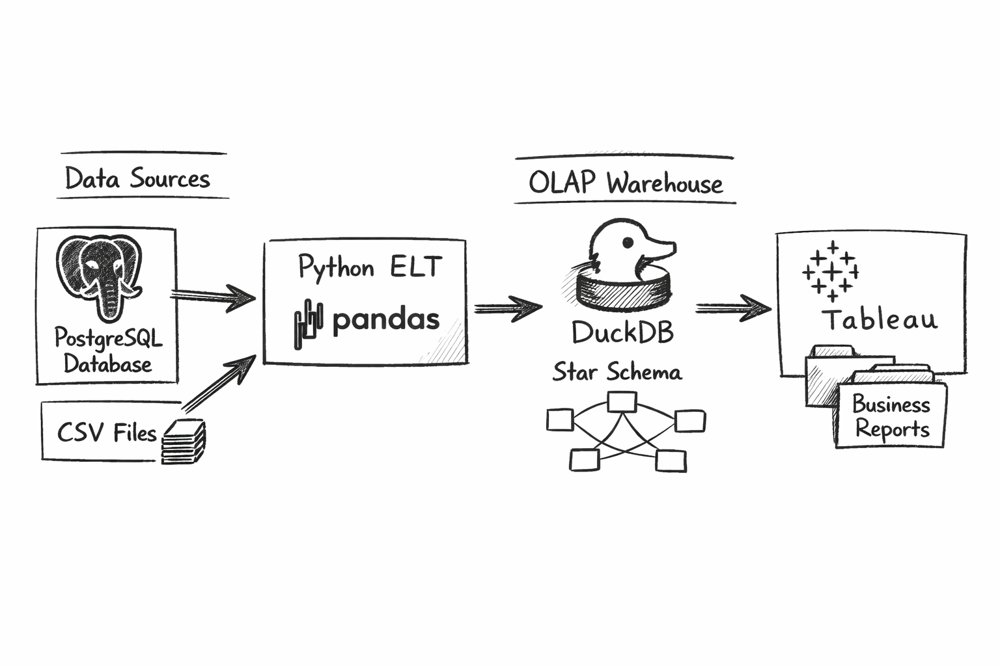

# 🧱 E-commerce Data Warehouse — End-to-End ELT Pipeline  
**PostgreSQL → DuckDB | Python | Pandas | Dimensional Modeling**

---

## 📖 Project Overview

This repository documents and implements a **complete, step-by-step build of an analytical data warehouse** for an e-commerce platform.

The project simulates a **real-world data engineering workflow**:
- Operational data is generated and stored in **PostgreSQL (OLTP)**
- Data is extracted and transformed using **Python & Pandas**
- Cleaned, analytics-ready data is loaded into **DuckDB (OLAP)**
- A **Kimball-style Star Schema** enables fast SQL-based business reporting

The goal is to demonstrate **core data engineering fundamentals**:  
data modeling, ELT design, SQL analytics, and warehouse performance — without unnecessary cloud complexity.

---

## 🏗️ Architecture Overview



**Pipeline flow (left → right):**

1. **Data Sources**
   - PostgreSQL transactional database
   - CSV batch files (simulated external inputs)

2. **Python ELT Layer**
   - Pandas-based extraction
   - Data cleaning and normalization
   - Revenue calculations and date handling

3. **OLAP Warehouse (DuckDB)**
   - File-based analytical database
   - Star Schema (Fact + Dimensions)
   - Optimized for analytical SQL queries

4. **Business Intelligence**
   - SQL aggregations
   - CSV outputs ready for BI tools (Tableau / Power BI)

---

## 🧠 Business Domain & Metrics

**Domain:** E-commerce platform  
**Fact grain:** One row per **order line item**

### Key Business Questions Answered
- How much revenue do we generate per day?
- How many orders are placed daily?
- Which products generate the most revenue?
- How many active users do we have per day?

### Core Metrics
- Daily revenue
- Daily order count
- Top products by revenue
- Daily Active Users (DAU)

All metrics are computed directly from the **fact table** using SQL.

---

## ⭐ Data Modeling Approach

The warehouse follows a **Kimball-style Star Schema**.

### Dimension Tables
- `dim_users` — customer attributes
- `dim_products` — product catalog
- `dim_date` — calendar dimension

### Fact Table
- `fact_orders`
  - order_id
  - user_id
  - product_id
  - order_date
  - quantity
  - revenue

This structure enables:
- Simple joins
- Fast aggregations
- Clear analytical semantics

---

## 🚀 Technical Stack

| Layer | Technology |
|-----|-----------|
| Language | Python 3.10+ |
| OLTP Database | PostgreSQL |
| OLAP Warehouse | DuckDB |
| Data Processing | Pandas |
| Data Modeling | Star Schema (Kimball) |
| Orchestration | Python scripts |
| Analytics | SQL |
| Reporting | CSV exports (BI-ready) |

---

## 📂 Repository Structure

```bash
.
├── data/                  # Raw CSV inputs
├── docs/
│   └── metrics.md         # Business metrics & definitions
├── sql/
│   ├── oltp_schema.sql    # PostgreSQL schema (OLTP)
│   └── olap_schema.sql    # DuckDB star schema (OLAP)
├── scripts/
│   ├── generate_data.py   # Synthetic data generation (Faker)
│   ├── etl.py             # ELT pipeline (Postgres → DuckDB)
│   └── aggregations.py   # Business metrics & reports
├── reports/               # Final analytical CSV outputs
├── assets/
│   └── architecture.png  # System architecture diagram
├── olap.duckdb            # Analytical warehouse (gitignored)
└── README.md
🔄 End-to-End Pipeline Flow
1️⃣ Data Generation
Synthetic users, products, orders, and order items

Generated using Faker

Loaded into PostgreSQL

2️⃣ Extract
Tables extracted from PostgreSQL using Pandas

Data loaded into memory for processing

3️⃣ Transform
Orders joined with order items

Revenue calculated (quantity × price)

Dates normalized and typed correctly

4️⃣ Load
Dimension tables loaded into DuckDB

Fact table populated with analytics-ready data

Star Schema created inside DuckDB

📈 Analytics & Outputs
The aggregations.py script produces:

📊 Daily revenue trends

🧾 Daily order counts

🛒 Top 10 products by revenue

👥 Daily Active Users (DAU)

All results are exported as CSV files to /reports
and can be directly connected to BI tools like Tableau.

🛠️ Setup & Usage
1️⃣ Clone Repository
bash
Copy code
git clone https://github.com/yourusername/ecommerce-data-warehouse.git
cd ecommerce-data-warehouse
2️⃣ Create & Activate Virtual Environment
bash
Copy code
python -m venv venv ( or if you have anaconda  ) 
source venv/bin/activate   # Mac/Linux
venv\Scripts\activate      # Windows
3️⃣ Install Dependencies
bash
Copy code
pip install -r requirements.txt
4️⃣ Generate Source Data
bash
Copy code
python scripts/generate_data.py
5️⃣ Run ELT Pipeline
bash
Copy code
python scripts/etl.py
python scripts/aggregations.py
🎯 Why This Project Matters
This project demonstrates:

✅ Realistic ELT patterns (not toy examples)

✅ Proper analytical data modeling

✅ SQL-first analytics

✅ Clear separation of OLTP vs OLAP

✅ Strong foundation for cloud warehouses (Snowflake / Databricks / Azure)

It mirrors how modern data teams actually build analytical systems.

🔮 Possible Extensions
Incremental loads

dbt transformations

Cloud storage (Azure Data Lake / S3)

Orchestration (Airflow / Databricks Jobs)

Data quality tests

👤 Author
Brahim askiou 
Data Engineer / Analytics Engineer
